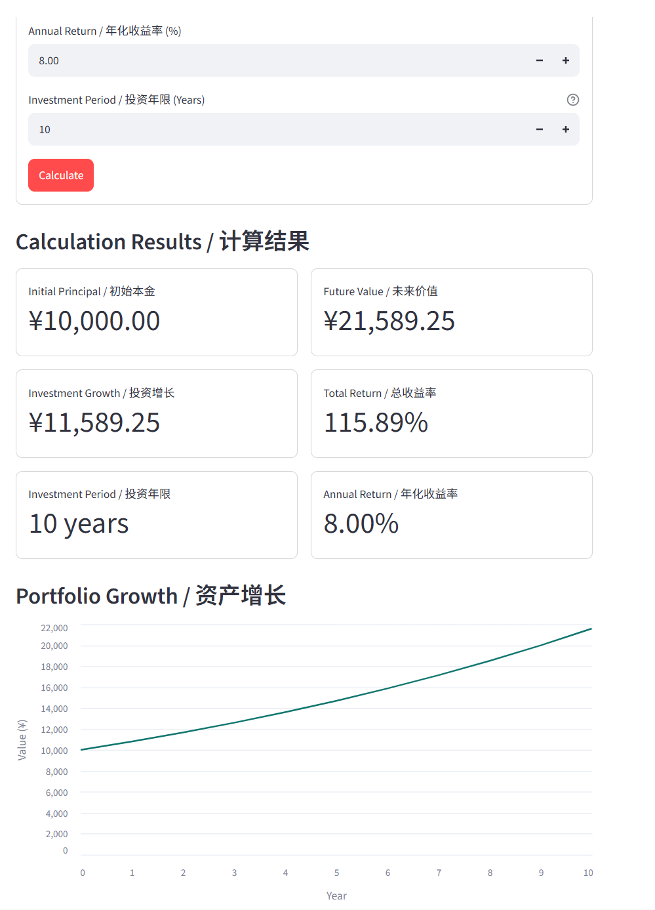
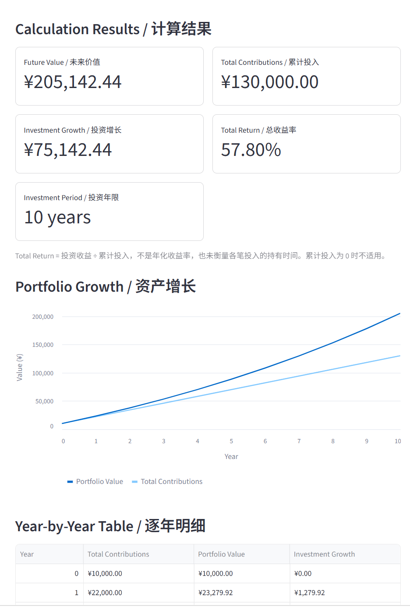
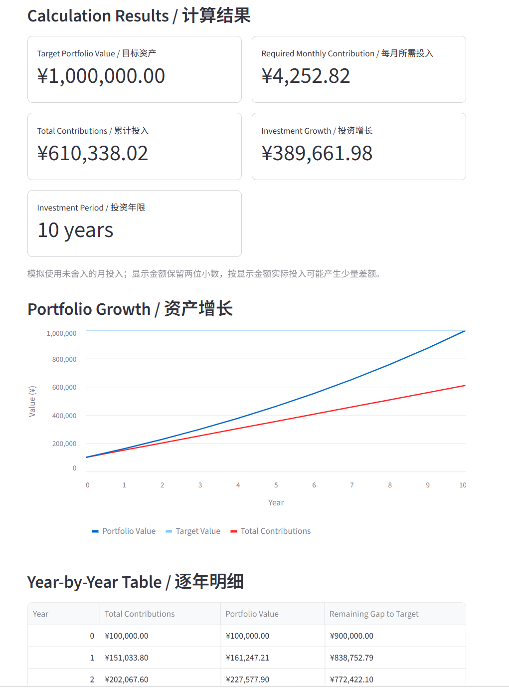

# Finance Mini Lab v0.1

A lightweight investment planning and financial education toolkit built with Python and Streamlit.

一个使用 **Python + Streamlit** 构建的轻量级投资规划与金融教育工具，用于模拟复利增长、定投积累和目标资产规划。当前版本：**v0.1.0**。

## Core Modules / 核心模块

| 模块 | 用途 |
|---|---|
| **Compound Interest / 复利计算** | 模拟一次性本金按年复利的增长，展示收益、逐年数据、收益构成及 4%、当前收益率、12% 的情景对比。 |
| **DCA Simulator / 定投模拟** | DCA（Dollar-Cost Averaging）即定期定额投资。本模块模拟初始本金加每月固定投入，对比累计投入与资产价值。 |
| **Goal Planner / 目标规划** | 根据目标资产、本金、收益率和期限反推每月所需投入，复用 DCA 模拟验证目标，并展示逐年目标差额。 |

三个模块通过独立标签页使用。网页之外，还保留了命令行复利计算器。

## Screenshot / Demo

以下为三个模块计算完成后的实际页面截图。

### Compound Interest



展示一次性本金的复利增长、收益指标和逐年资产变化。

### DCA Simulator



展示每月固定投入下的资产积累，以及累计投入与投资增长的差距。

### Goal Planner



展示达到目标资产所需的月投入，以及模拟资产与目标线的对比。

当前没有在线 Demo 地址；可按下方 Run Locally 步骤运行项目。

## Key Features / 主要功能

- Compound growth simulation：年度复利增长模拟。
- Monthly DCA simulation：月度复利与月末定投模拟。
- Goal-based contribution planning：目标导向的月投入反推。
- Growth charts：资产、累计投入与目标参考线。
- Year-by-year tables：从 Year 0 开始的逐年明细。
- Scenario analysis：复利模块固定收益率情景对比，自动去重。
- Financial insights：结果摘要与 Rule of 72 近似翻倍估算。
- Input validation：友好处理无效输入、非有限数值及计算溢出。
- Automated tests：核心计算与 Streamlit 页面自动化测试。

## Tech Stack / 技术栈

- **Python 3.12**：已验证的运行环境。
- **Streamlit**：网页界面、交互表单、图表和表格。
- **Python standard library**：金融计算、输入校验及 `unittest` 测试。
- **Streamlit AppTest**：页面交互测试，包含在 Streamlit 中。
- **Git**：版本管理。

唯一声明的第三方直接依赖为 `streamlit>=1.50,<2`。开发验证使用 Python 3.12.14 / Streamlit 1.64.0。Streamlit 所需的 pandas、Altair 等间接依赖由 pip 自动安装，无需另行手动安装。

## Project Structure / 项目结构

```text
Finance-Mini-Lab/
├─ README.md
├─ requirements.txt
├─ .gitignore
├─ app.py                         # 命令行复利计算器
├─ streamlit_app.py               # 三模块网页入口
├─ src/                          # 独立金融计算逻辑
│  ├─ compound_interest.py
│  ├─ dca.py
│  └─ goal_planner.py
├─ tests/                        # 核心计算与页面测试
│  ├─ test_streamlit_app.py
│  ├─ test_dca.py
│  ├─ test_dca_ui.py
│  ├─ test_goal_planner.py
│  └─ test_goal_planner_ui.py
└─ docs/
   └─ project_log.md              # 里程碑及验证记录
```

`assets/` 保存下方 Screenshot / Demo 区域引用的三张正式 PNG 截图。`.venv/`、缓存及 IDE 临时文件由 `.gitignore` 排除。

## Installation / 安装

先安装 Python 3.12 和 Git。以下命令均在终端执行。

### 1. 获取项目

从 GitHub 克隆项目，然后进入项目目录：

```bash
git clone https://github.com/Knox-SijieJiang/Finance-Mini-Lab.git
cd Finance-Mini-Lab
```

如果已经持有本地项目目录，直接进入该目录，跳过克隆步骤。

### 2. 创建虚拟环境并安装依赖

**Windows / PowerShell：**不必激活虚拟环境，直接调用其中的 Python，避免执行策略问题。

```powershell
py -3.12 -m venv .venv
.\.venv\Scripts\python.exe -m pip install -r requirements.txt
```

如果没有 `py` 启动器，可将第一行改为 `python -m venv .venv`，并确认该 Python 为 3.12；若命令未加入 PATH，可使用解释器的完整路径。

**macOS / Linux：**

```bash
python3.12 -m venv .venv
source .venv/bin/activate
python -m pip install -r requirements.txt
```

若系统使用 `python3`，请先确认 `python3 --version` 为所需版本。

## Run Locally / 本地运行

在项目根目录、已激活虚拟环境的终端中运行：

```bash
python -m streamlit run streamlit_app.py
```

Windows 无需激活即可运行：

```powershell
.\.venv\Scripts\python.exe -m streamlit run streamlit_app.py
```

打开终端显示的 Local URL，通常是 [http://localhost:8501](http://localhost:8501)。选择模块、填写参数并点击 **Calculate**；终端按 `Ctrl+C` 停止服务。

运行 CLI 复利版本：

```bash
python app.py
```

Windows 未激活环境时可使用 `.\.venv\Scripts\python.exe app.py`。CLI 年化收益率输入 `8` 表示 8%；三个网页模块也采用百分数输入，而核心函数接收小数 `0.08`。

## Testing / 测试

在项目根目录运行完整套件：

```bash
python -m unittest discover -s tests -v
```

Windows 无需激活环境的运行方式：

```powershell
.\.venv\Scripts\python.exe -m unittest discover -s tests -v
```

当前有 **37 个测试方法**，覆盖核心计算、输入边界、零本金、零收益率、情景去重、图表、表格、目标回算及模块切换。AppTest 在某些环境可能输出 `missing ScriptRunContext` 提示，以最后的测试结果为准。

### 标准验证案例

| 模块 | 输入 | 预期结果 |
|---|---|---:|
| Compound Interest | 本金 10,000；年化 8%；10 年 | 未来价值 ¥21,589.25 |
| DCA Simulator | 本金 10,000；每月投入 1,000；年化 8%；10 年 | 未来价值 ¥205,142.44 |
| Goal Planner | 目标 1,000,000；本金 100,000；年化 8%；10 年 | 每月所需投入约 ¥4,252.82 |

## Calculation Notes / 计算口径

- **Compound Interest**：`FV = PV × (1 + r)^n`，每年复利，无追加投入。
- **DCA**：月收益率为 `r / 12`，每月先增长、再加入固定投入；累计投入包含初始本金。总收益率为投资增长除以累计投入，不是年化或资金加权收益率。
- **Goal Planner**：复用 DCA 的本金期末价值与单位月投入系数反推金额，再通过 DCA 回算。本金自身增长已达到目标时，月投入为 0。
- 月度复利与年度复利在同一名义年化收益率下通常产生不同结果。
- Compound Interest 与 DCA 支持 0–1000 整数年；Goal Planner 支持 1–1000 整数年，目标必须大于 0。本金和月投入非负，收益率必须大于 -100%。
- 内部计算保留完整精度，显示时才舍入。目标规划按显示的两位小数金额投入可能产生少量差额；回算允许误差为 `max(target × 1e-9, 1e-6)`。
- 零本金或零累计投入时，相应收益率显示 N/A。Rule of 72 仅在正收益率下展示，是近似估算。

## Assumptions / 假设说明

- **Fixed return assumption**：收益率固定，不保证实际收益。
- **Compounding frequency depends on module**：复利模块按年，DCA 和目标规划按月。
- **No tax, inflation or fees**：不考虑税费、通胀和手续费。
- **No real market volatility**：不模拟真实市场波动，也不使用真实行情。
- **Educational use only**：仅用于金融教育和演示。
- **Not investment advice**：结果不构成投资建议或市场回报预测。

## Roadmap / 未来方向

以下为潜在探索方向，**不属于 v0.1，尚未实现或承诺交付**：

- Inflation adjustment / 通胀调整。
- Real market data / 真实市场数据。
- Portfolio analytics / 投资组合分析。
- Sharpe ratio / 夏普比率。
- Scenario modelling / 更广泛的情景建模，超出现有固定收益率对比。

## Version / 版本

当前版本：**v0.1.0**。界面保留 `Finance Mini Lab v0.1` 标题。

开发过程与各里程碑验证记录见 [Project Log](docs/project_log.md)。
